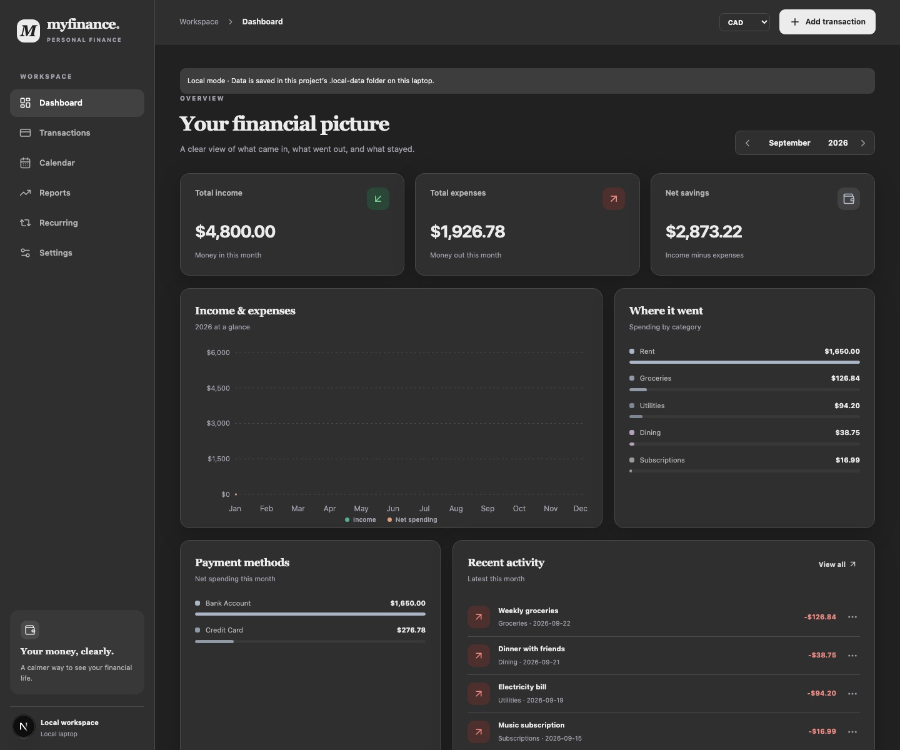

# My Finance · Personal Finance Manager

A private, responsive finance app built with Next.js, Supabase, Tailwind CSS, and Recharts. It supports transaction entry, custom lists, monthly dashboards, reports, a spending calendar, reviewed recurring transactions, currency conversion, dark mode, and CSV export.

## Preview

The dashboard below uses fictional demo transactions. Run `npm run demo` to create the same kind of sample data locally.

## Run on your laptop (no account needed)

1. Open this folder in VS Code and open **Terminal → New Terminal**.
2. Run `npm install` (only needed the first time).
3. Run `npm run dev:local`.
4. Open `http://127.0.0.1:3000` in your browser.

You can add and edit transactions immediately. Local data is saved in `.local-data/finance.json` in this project folder and is ignored by Git. The development server listens only on this laptop. No Supabase account or `.env.local` is needed for this mode. If a Supabase `.env.local` already exists, `npm run dev:local` still uses the local file. Stop the server with **Ctrl+C**. Back up the `.local-data` folder if you want to preserve this ledger; it does not automatically sync with Supabase.

### Optional fictional demo

On a fresh clone, run `npm run demo` before `npm run dev:local` to create an entirely fictional sample ledger. It includes current and previous-month examples for salary, rent, mortgage, groceries, utilities, dining, and a subscription, plus demo Visa, Mastercard, and Amex accounts. The dates are generated relative to the day you run the command so the dashboard remains useful.

The demo command refuses to replace an existing `.local-data/finance.json`. Your personal ledger and all local backups remain ignored by Git. To use the normal empty personal ledger, skip the demo command and run `npm run dev:local` directly.

## Set up multi-user hosted accounts

1. Run `npm install`.
2. Create a Supabase project. Run the SQL files in `supabase/migrations` in filename order. The migrations create the tables, per-user row-level security policies, reporting-currency support, and default categories/methods for every newly created account.
3. In Supabase **Authentication → Providers**, keep Email enabled with email confirmation on. To offer Google too, enable Google and create a Google Cloud OAuth web client with an external audience and the basic `openid`, email, and profile scopes. In Google Cloud, add the Supabase callback URL shown on that provider page as an authorized redirect URI; add the local and production app origins as authorized JavaScript origins. Copy the Google client ID and secret into the Supabase provider settings only.
4. In Supabase Auth settings, enable **Allow new users to sign up** and keep anonymous sign-ins disabled. Add both `/auth/callback` and `/auth/recovery` URLs for `http://127.0.0.1:3000`, `http://localhost:3000`, and the production `https://<your-vercel-domain>` to **Redirect URLs**. Set **Site URL** to the production app URL. Keep email confirmation enabled.
5. Configure **Authentication → SMTP Settings** with an email provider's SMTP host, port, username, password, and sender address. Supabase's default mail sender only delivers to project team addresses, so public email/password signup, confirmation, and password reset need custom SMTP. These credentials belong in Supabase, never in the browser or `NEXT_PUBLIC_` variables. Google OAuth alone does not require custom SMTP.
6. Copy `.env.example` to `.env.local` and enter the Supabase project URL and publishable key. Never put a service-role key or Google client secret in `NEXT_PUBLIC_` variables.
7. Run `npm run dev` and open `http://127.0.0.1:3000`. Choose **Sign up** to create an account with email/password or Google. Email users follow the confirmation link before logging in. **Forgot password?** sends a reset link. Every new account gets a separate private ledger.

For deployment, link this project to Vercel, add `NEXT_PUBLIC_SUPABASE_URL` and `NEXT_PUBLIC_SUPABASE_PUBLISHABLE_KEY` to the Vercel Production environment, and deploy. The free `vercel.app` domain works without buying a custom domain. Add that exact domain's `/auth/callback` URL to Supabase before testing Google sign-in. Keep the Supabase project private and use its dashboard to manage backups.

Each person can use email/password or Google sign-in to create their own private ledger. The existing local `.local-data/finance.json` ledger is not uploaded or synced. Run `npm run dev:local` to continue using it independently.

## Data rules

- Amounts are positive integer minor units. Supported currencies (CAD, USD, EUR, GBP, AUD, INR) all use two decimal places.
- Expense increases expenses. Income and income-like Other increase income. Neutral Other does not affect totals. Salary uses an Income category; refunds are entered as Income.
- Net savings = income − expenses.
- Every transaction retains its entered amount and currency. The top-bar reporting currency converts views with a cached reference rate from the transaction date. A missing uncached rate requires an internet connection; original values are never rewritten.
- Accounts/cards label transactions; balances are not tracked.
- Recurring rules create no transaction until the owner chooses **Post**. **Skip** advances the due date without changing totals.
- Reporting-currency conversion uses cached historical reference rates from Frankfurter. Original transaction amounts are preserved, including when the reporting currency changes.

## Checks

Run `npm run privacy:check`, `npm run typecheck`, `npm run lint`, `npm test`, and `npm run build`.

The database access policies and RPCs require a configured Supabase project for an integration test. After setup, sign in with two different accounts, add a transaction in each, and verify neither account can read or change the other's rows. Confirm both accounts receive their own settings and default categories, and that confirmation, reset, and Google sign-in return to the local and production app URLs.
